# Hall Canteen — Backend System Design

> Single source of truth for the FastAPI backend: architecture, mechanisms, data
> model, authentication & session management, and operational concerns — with
> Mermaid diagrams and workflow diagrams throughout.

**Stack:** FastAPI · Python 3.12 · async SQLAlchemy 2 + asyncpg (PostgreSQL) ·
Redis (sessions) · Alembic · `uv` · structlog · Docker.

---

## Table of contents

1. [System context](#1-system-context)
2. [Layered architecture](#2-layered-architecture)
3. [Directory structure](#3-directory-structure)
4. [Request lifecycle](#4-request-lifecycle)
5. [Data model](#5-data-model)
6. [Authentication & session management](#6-authentication--session-management)
   - [6.1 Design principles](#61-design-principles)
   - [6.2 Redis session model](#62-redis-session-model)
   - [6.3 Email + password registration](#63-email--password-registration)
   - [6.4 Email + password login](#64-email--password-login)
   - [6.5 Google (Firebase) sign-in](#65-google-firebase-sign-in)
   - [6.6 Authenticated request](#66-authenticated-request)
   - [6.7 Logout](#67-logout)
   - [6.8 Session lifecycle](#68-session-lifecycle)
7. [Authorization (roles)](#7-authorization-roles)
8. [Email domain restriction (DIU)](#8-email-domain-restriction-diu)
9. [Configuration](#9-configuration)
10. [Error model](#10-error-model)
11. [Security model](#11-security-model)
12. [Deployment](#12-deployment)
13. [Roadmap](#13-roadmap)

---

## 1. System context

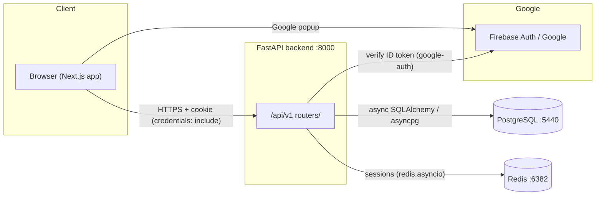

- The browser authenticates the user (Google popup **or** email/password) and
  talks to the backend with an **httpOnly session cookie**.
- The backend is the **source of truth** for identity and sessions. It verifies
  Firebase ID tokens, persists users in PostgreSQL, and stores opaque sessions in
  Redis.

## 2. Layered architecture

The codebase follows a strict **Repository pattern** — services never touch the
ORM directly; HTTP concerns never leak into services.

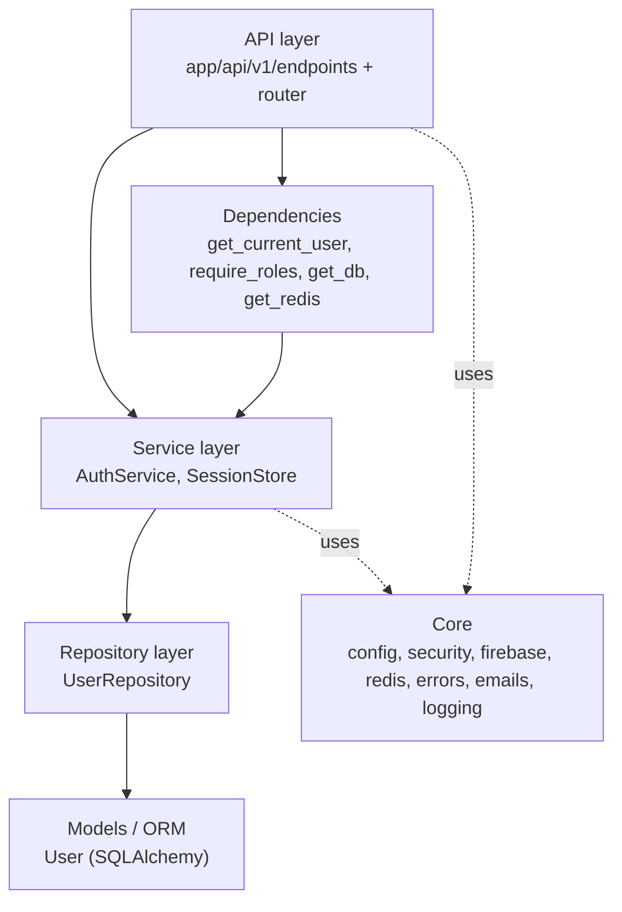

| Layer | Responsibility | Must NOT |
|-------|----------------|----------|
| API (endpoints) | HTTP I/O, cookies, status codes, response models | contain business rules |
| Dependencies | resolve DB/Redis, authenticate, authorize | hold state |
| Services | business rules, orchestration | format HTTP / touch the ORM |
| Repositories | all ORM access | contain business rules |
| Core | cross-cutting utilities (hash, token verify, Redis client, errors) | depend on API |

## 3. Directory structure

```
backend/
├── app/
│   ├── main.py                      # App factory, lifespan (Redis), CORS, error handler, /health
│   ├── core/
│   │   ├── config.py                # Settings (pydantic-settings)
│   │   ├── security.py              # bcrypt hash/verify, JWT helpers (legacy)
│   │   ├── redis.py                 # Async Redis client + get_redis dependency
│   │   ├── firebase.py              # Firebase ID-token verification (google-auth)
│   │   ├── errors.py                # APIError + handler -> {detail, code}
│   │   ├── emails.py                # Allowed email-domain policy
│   │   └── logging.py               # structlog config
│   ├── db/
│   │   ├── session.py               # Async engine, session factory, Base, get_db
│   │   ├── models/user.py           # User model + Role enum
│   │   └── migrations/              # Alembic (versions/0001_create_users.py)
│   ├── repositories/user.py         # UserRepository (all ORM access)
│   ├── services/
│   │   ├── auth.py                  # AuthService (register/login/google/logout)
│   │   └── session.py               # SessionStore (Redis-backed sessions)
│   ├── schemas/auth.py              # Pydantic request/response models
│   └── api/v1/
│       ├── router.py                # Aggregates routers under /api/v1
│       ├── endpoints/auth.py        # /auth/{register,login,login/google,logout,me}
│       └── dependencies/auth.py     # get_current_user, require_roles
├── docs/ARCHITECTURE.md             # ← this document
├── alembic.ini · pyproject.toml · uv.lock · Dockerfile · docker-compose.yml
```

## 4. Request lifecycle

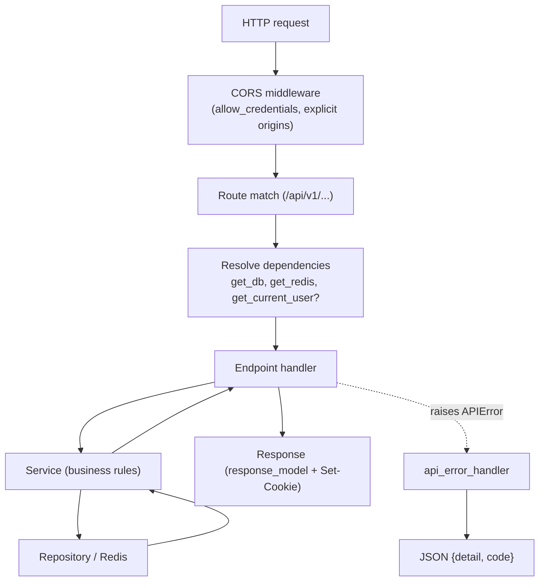

- A shared **async Redis client** is created in the FastAPI `lifespan` and stored
  on `app.state.redis`; `get_redis` hands it to dependencies. Connections are
  lazy, so startup never blocks on Redis.
- A new **async SQLAlchemy session** is created per request by `get_db`.

## 5. Data model

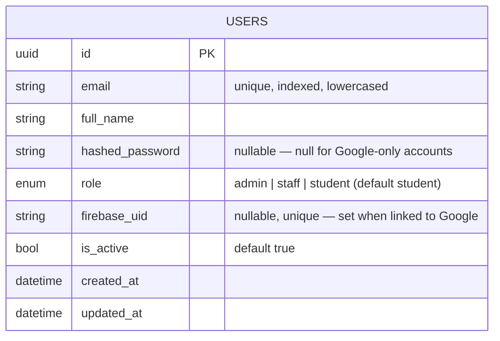

- One table today (`users`). `role` is a PostgreSQL enum `user_role`.
- An account may have a password, a Firebase identity, or **both** (a password
  user who later signs in with the same Google email gets the `firebase_uid`
  linked).
- Migrations are **forward-only** (Alembic). The first migration
  `0001_create_users` creates the enum + table + unique indexes on `email` and
  `firebase_uid`.

## 6. Authentication & session management

### 6.1 Design principles

- **Opaque, server-side sessions** stored in Redis — *not* a JWT in the cookie.
  This makes sessions **revocable**, keeps secrets server-side, and lets us
  invalidate all of a user's sessions instantly.
- The session id is a 256-bit random token (`secrets.token_urlsafe(32)`),
  delivered to the browser **only** as an `HttpOnly` cookie (`hc_session`).
- **Firebase is an identity provider** (it proves "this is a valid Google user");
  the backend issues and owns the session. Firebase ID tokens are verified with
  `google-auth` against Google's public keys — **no service-account secret
  required**.
- Two credential paths, **one session mechanism**: email/password and Google
  both converge on `SessionStore.create()`.

### 6.2 Redis session model

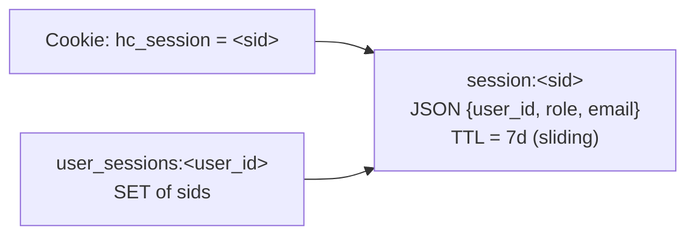

| Key | Type | Value | TTL |
|-----|------|-------|-----|
| `session:<sid>` | string | `{"user_id","role","email"}` | 7 days, **refreshed on every authenticated read** (sliding expiration) |
| `user_sessions:<user_id>` | set | all active `sid`s for the user | 7 days |

- `create(user)` → new sid, `SET session:<sid>` with TTL, add sid to the user's
  set. Returns the sid.
- `get(sid)` → read JSON; if present, **refresh the TTL** and return it; else `None`.
- `delete(sid)` → remove the key and de-index it from the user's set.
- `delete_all_for_user(user_id)` → revoke every session for a user.

### 6.3 Email + password registration

```mermaid
sequenceDiagram
    autonumber
    participant FE as Frontend
    participant EP as POST /auth/register
    participant SV as AuthService
    participant UR as UserRepository
    participant PG as PostgreSQL
    participant SS as SessionStore
    participant RD as Redis

    FE->>EP: {email, password, full_name}
    EP->>SV: register(...)
    SV->>SV: normalize email; assert @diu.edu.bd
    SV->>UR: get_by_email(email)
    UR->>PG: SELECT
    alt email exists
        SV-->>EP: APIError 409 EMAIL_TAKEN
    else new
        SV->>UR: create(email, full_name, bcrypt(password), role=student)
        UR->>PG: INSERT
        SV->>SS: create(user)
        SS->>RD: SET session:&lt;sid&gt; (TTL)
        SV-->>EP: (user, sid)
        EP-->>FE: 201 UserRead + Set-Cookie hc_session (HttpOnly)
    end
```

### 6.4 Email + password login

```mermaid
sequenceDiagram
    autonumber
    participant FE as Frontend
    participant EP as POST /auth/login
    participant SV as AuthService
    participant UR as UserRepository
    participant SS as SessionStore

    FE->>EP: {email, password}
    EP->>SV: login(...)
    SV->>SV: normalize email; assert @diu.edu.bd
    SV->>UR: get_by_email(email)
    alt no user / no password / bad password
        SV-->>EP: APIError 401 INVALID_CREDENTIALS
    else valid + active
        SV->>SS: create(user)
        SV-->>EP: (user, sid)
        EP-->>FE: 200 UserRead + Set-Cookie hc_session
    end
```

> Password verification uses **bcrypt directly** (the abandoned `passlib`
> crashes on bcrypt 5.x). Passwords are truncated to bcrypt's 72-byte limit.

### 6.5 Google (Firebase) sign-in

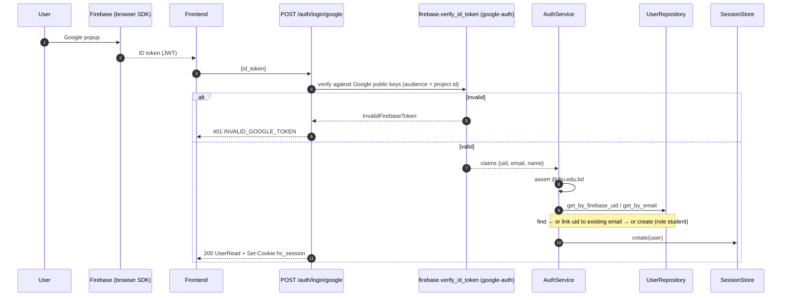

Token verification runs in a thread pool (`run_in_threadpool`) because
`google-auth` performs blocking HTTP to fetch Google's signing certificates.

### 6.6 Authenticated request

```mermaid
sequenceDiagram
    autonumber
    participant FE as Frontend
    participant EP as GET /auth/me (any protected route)
    participant DEP as get_current_user
    participant SS as SessionStore
    participant RD as Redis
    participant UR as UserRepository

    FE->>EP: request + Cookie hc_session
    EP->>DEP: resolve dependency
    DEP->>SS: get(sid)
    SS->>RD: GET session:&lt;sid&gt; + refresh TTL
    alt missing/expired
        DEP-->>FE: 401 SESSION_EXPIRED / NOT_AUTHENTICATED
    else found
        DEP->>UR: get_by_id(user_id)
        Note over DEP,UR: re-load user → enforces is_active + current role
        DEP-->>EP: User
        EP-->>FE: 200 UserRead
    end
```

The user is **re-loaded from the DB** on each request (not trusted from the
session blob alone), so deactivation and role changes take effect immediately.

### 6.7 Logout

```mermaid
sequenceDiagram
    autonumber
    participant FE as Frontend
    participant EP as POST /auth/logout
    participant SS as SessionStore
    participant RD as Redis
    FE->>EP: request + Cookie
    EP->>SS: delete(sid)
    SS->>RD: DEL session:&lt;sid&gt; + de-index
    EP-->>FE: 204 + clear cookie
```

### 6.8 Session lifecycle

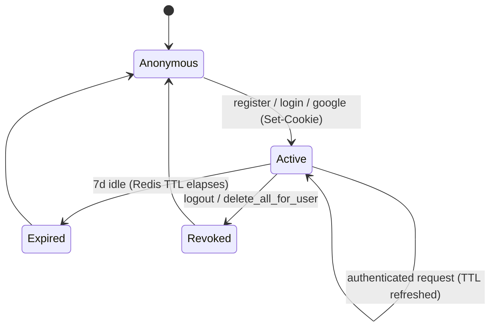

## 7. Authorization (roles)

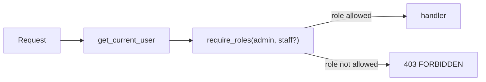

- Roles: `admin` · `staff` · `student` (default). New accounts are always
  `student`; promotion is manual (`UPDATE users SET role='admin' WHERE email=…`).
- `require_roles(*roles)` is a dependency factory used to guard endpoints, e.g.
  `Depends(require_roles(Role.admin))` for reports.

## 8. Email domain restriction (DIU)

Only DIU institutional emails may register or sign in. Enforced in the service
layer for **all** credential paths (register, login, Google).

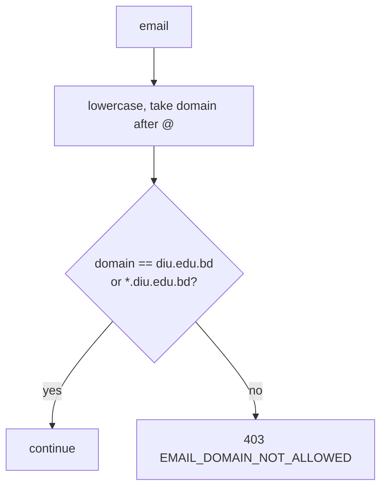

- Configured by `allowed_email_domains` (default `["diu.edu.bd"]`); accepts the
  apex domain and any subdomain (e.g. `s.diu.edu.bd`). An empty list disables it.

## 9. Configuration

`app/core/config.py` (pydantic-settings, read from `.env`). Highlights:

| Setting | Env var | Default | Notes |
|---------|---------|---------|-------|
| `database_url` | `DATABASE_URL` | — | async DSN (`postgresql+asyncpg://…:5440/…`) |
| `redis_url` | `REDIS_URL` | `redis://localhost:6379/0` | `…:6382/0` locally |
| `secret_key` | `SECRET_KEY` | — | required |
| `firebase_project_id` | `FIREBASE_PROJECT_ID` | `None` | required for Google sign-in |
| `session_cookie_name` | — | `hc_session` | |
| `session_ttl_seconds` | `SESSION_TTL_SECONDS` | `604800` (7d) | sliding |
| `session_cookie_secure` | `SESSION_COOKIE_SECURE` | `false` | **`true` in prod (HTTPS)** |
| `session_cookie_samesite` | `SESSION_COOKIE_SAMESITE` | `lax` | **`none` for cross-site prod** |
| `allowed_email_domains` | `ALLOWED_EMAIL_DOMAINS` | `["diu.edu.bd"]` | JSON array |
| `backend_cors_origins` | `BACKEND_CORS_ORIGINS` | `["http://localhost:3000"]` | JSON array |

## 10. Error model

All domain errors raise `APIError(status_code, code, detail)` and are rendered by
a single handler as:

```json
{ "detail": "Human readable message", "code": "SNAKE_CASE_CODE" }
```

| Code | HTTP | Raised when |
|------|------|-------------|
| `NOT_AUTHENTICATED` | 401 | no/invalid session cookie |
| `SESSION_EXPIRED` | 401 | session missing/expired in Redis |
| `INVALID_CREDENTIALS` | 401 | bad email/password |
| `INVALID_GOOGLE_TOKEN` | 401 | Firebase token fails verification |
| `EMAIL_TAKEN` | 409 | register with an existing email |
| `EMAIL_DOMAIN_NOT_ALLOWED` | 403 | non-DIU email |
| `ACCOUNT_DISABLED` | 403 | `is_active = false` |
| `FORBIDDEN` | 403 | role not permitted |

## 11. Security model

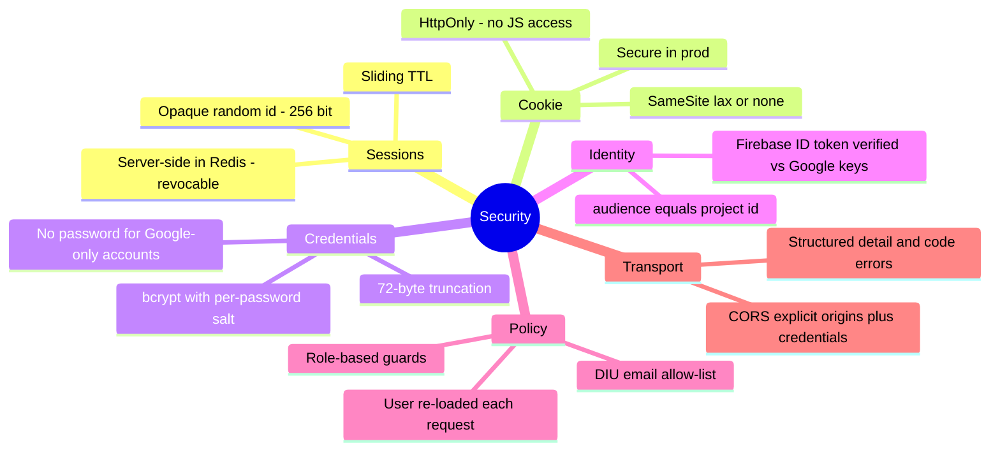

## 12. Deployment

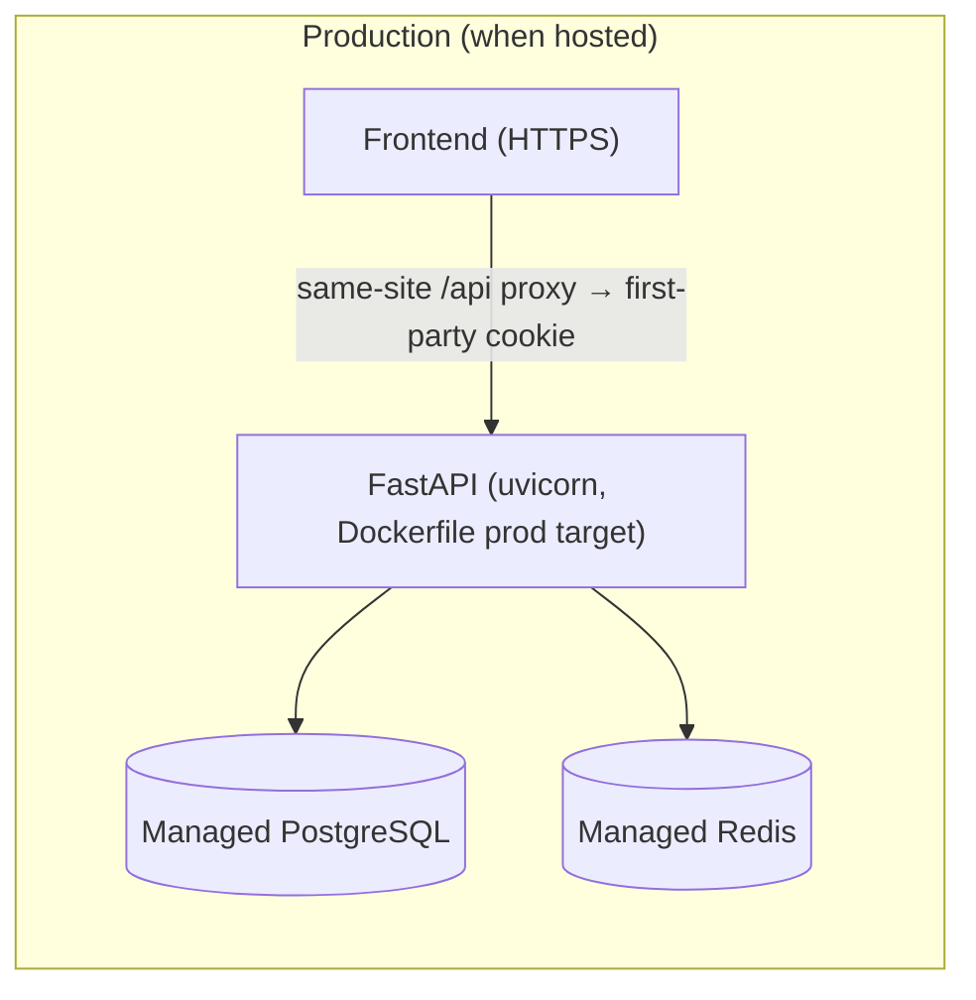

- The `Dockerfile` has `development` (fastapi dev) and `production` (uvicorn,
  4 workers, non-root) targets; `docker-compose.yml` wires Postgres + Redis +
  API with healthchecks.
- **Production checklist:** `SESSION_COOKIE_SECURE=true`,
  `SESSION_COOKIE_SAMESITE=none` (cross-site) **or** serve the frontend and API
  on the same site so the cookie stays first-party; add the frontend origin to
  `BACKEND_CORS_ORIGINS`; run `alembic upgrade head` on release.
- Local run: `docker compose up -d postgres redis && make migrate`, then
  `uv run fastapi dev app/main.py`.

## 13. Roadmap

Phased domain modules (auth is complete; the rest reuse these layers):

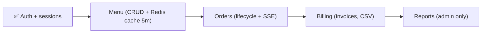

Each new module adds: a model + migration, a repository, a service, schemas, a
router under `/api/v1`, and role guards via `require_roles`.
