# Hall Canteen — Backend System Design

> Single source of truth for the FastAPI backend. All diagrams are **use case**,
> **activity**, or **sequence** diagrams (Mermaid). Structural information is kept
> as tables and text.

**Stack:** FastAPI · Python 3.12 · async SQLAlchemy 2 + asyncpg (PostgreSQL) ·
Redis (sessions) · Alembic · `uv` · structlog · Docker.

---

## Table of contents

1. [Use case diagram](#1-use-case-diagram)
2. [Directory structure](#2-directory-structure)
3. [Data model](#3-data-model)
4. [Workflows — activity diagrams](#4-workflows--activity-diagrams)
   - [4.1 Registration](#41-registration)
   - [4.2 Email login](#42-email-login)
   - [4.3 Google sign-in](#43-google-sign-in)
   - [4.4 Authenticated request & session validation](#44-authenticated-request--session-validation)
   - [4.5 Authorization (role check)](#45-authorization-role-check)
5. [Interactions — sequence diagrams](#5-interactions--sequence-diagrams)
   - [5.1 Registration](#51-registration)
   - [5.2 Email login](#52-email-login)
   - [5.3 Google sign-in](#53-google-sign-in)
   - [5.4 Authenticated request (/auth/me)](#54-authenticated-request-authme)
   - [5.5 Logout](#55-logout)
6. [Redis session model](#6-redis-session-model)
7. [Configuration](#7-configuration)
8. [Error model](#8-error-model)
9. [Security model](#9-security-model)
10. [Deployment](#10-deployment)

---

## 1. Use case diagram

Actors and the use cases they can perform. The system boundary holds the use
cases; dotted arrows show `include` relationships (a use case always invokes
another).

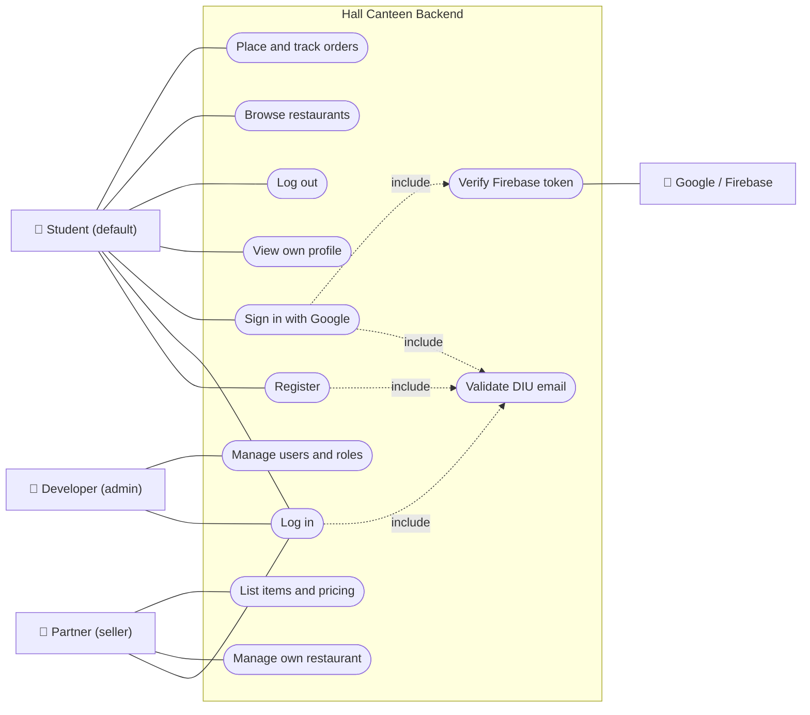

The authentication use cases (`a1`–`a5`) are available to **all** roles; only the
role-specific ones are drawn per actor for clarity.

### Roles & access control

| Capability | Student (default) | Partner (seller) | Developer (admin) |
|------------|:----------------:|:----------------:|:-----------------:|
| Sign up / sign in / profile | ✅ | ✅ | ✅ |
| Browse restaurants & items | ✅ | ✅ | ✅ |
| Place & track orders | ✅ | — | ✅ |
| Create / manage own restaurant | — | ✅ | ✅ |
| List food items with details & pricing | — | ✅ | ✅ |
| Manage users, roles & everything | — | — | ✅ |

- **Default role is `student`**; promotion to `partner` or `developer` is manual
  (`UPDATE users SET role='partner' WHERE email=…`).
- **`developer` is a superuser** — `require_roles(...)` always permits it, so it
  satisfies every role guard.
- The student/partner capabilities above are enforced by `require_roles` as the
  Menu and Orders modules are built; the auth layer and the guard are in place now.

## 2. Directory structure

```
backend/
├── app/
│   ├── main.py                      # App factory, lifespan (Redis), CORS, error handler, /health
│   ├── core/
│   │   ├── config.py                # Settings (pydantic-settings)
│   │   ├── security.py              # bcrypt hash/verify, JWT helpers (legacy)
│   │   ├── redis.py                 # Async Redis client + get_redis dependency
│   │   ├── firebase.py              # Firebase ID-token verification (google-auth)
│   │   ├── errors.py                # APIError + handler -> {detail, code}
│   │   ├── emails.py                # Allowed email-domain policy
│   │   └── logging.py               # structlog config
│   ├── db/
│   │   ├── session.py               # Async engine, session factory, Base, get_db
│   │   ├── models/user.py           # User model + Role enum
│   │   └── migrations/              # Alembic (versions/0001_create_users.py)
│   ├── repositories/user.py         # UserRepository (all ORM access)
│   ├── services/
│   │   ├── auth.py                  # AuthService (register/login/google/logout)
│   │   └── session.py               # SessionStore (Redis-backed sessions)
│   ├── schemas/auth.py              # Pydantic request/response models
│   └── api/v1/
│       ├── router.py                # Aggregates routers under /api/v1
│       ├── endpoints/auth.py        # /auth/{register,login,login/google,logout,me}
│       └── dependencies/auth.py     # get_current_user, require_roles
├── docs/ARCHITECTURE.md             # ← this document
└── alembic.ini · pyproject.toml · uv.lock · Dockerfile · docker-compose.yml
```

**Layering (Repository pattern):** API → dependencies → services → repositories →
models. Services never touch the ORM directly; HTTP concerns never enter services.

## 3. Data model

Table `users` (PostgreSQL). `role` is the enum `user_role`.

| Column | Type | Notes |
|--------|------|-------|
| `id` | uuid | primary key |
| `email` | varchar(320) | unique, indexed, lowercased |
| `full_name` | varchar(255) | |
| `hashed_password` | varchar(255) | nullable — null for Google-only accounts |
| `role` | enum | `developer` / `partner` / `student` (default `student`) |
| `firebase_uid` | varchar(128) | nullable, unique — set when linked to Google |
| `is_active` | bool | default true |
| `created_at` / `updated_at` | timestamptz | server defaults |

Migrations are forward-only (Alembic); `0001_create_users` creates the enum,
table, and unique indexes on `email` and `firebase_uid`.

## 4. Workflows — activity diagrams

### 4.1 Registration

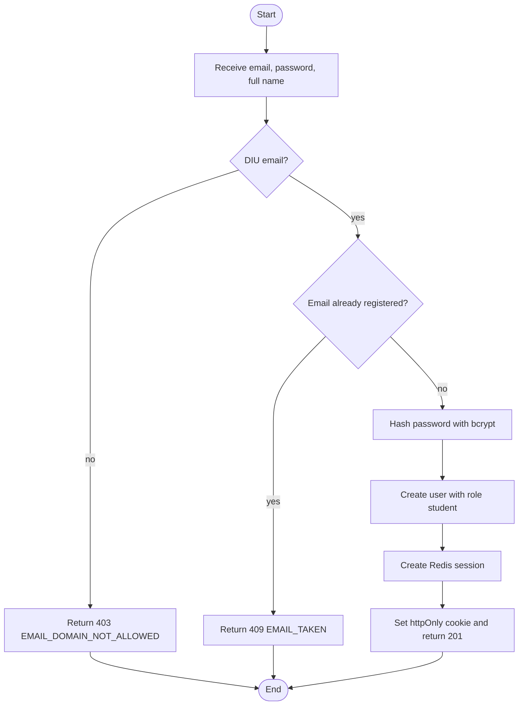

### 4.2 Email login

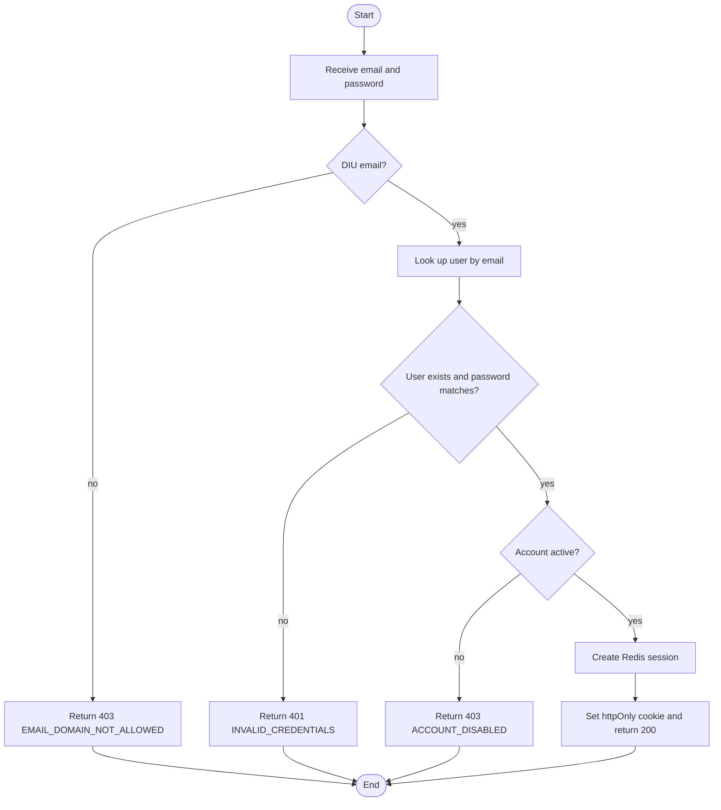

### 4.3 Google sign-in

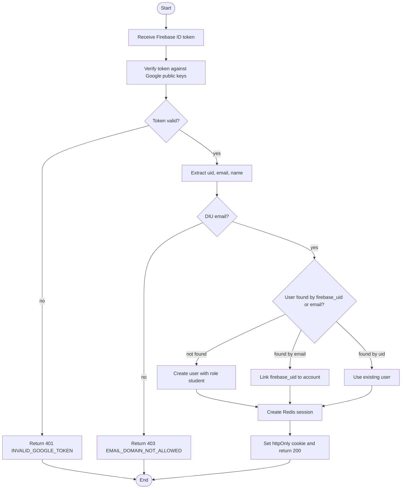

### 4.4 Authenticated request & session validation

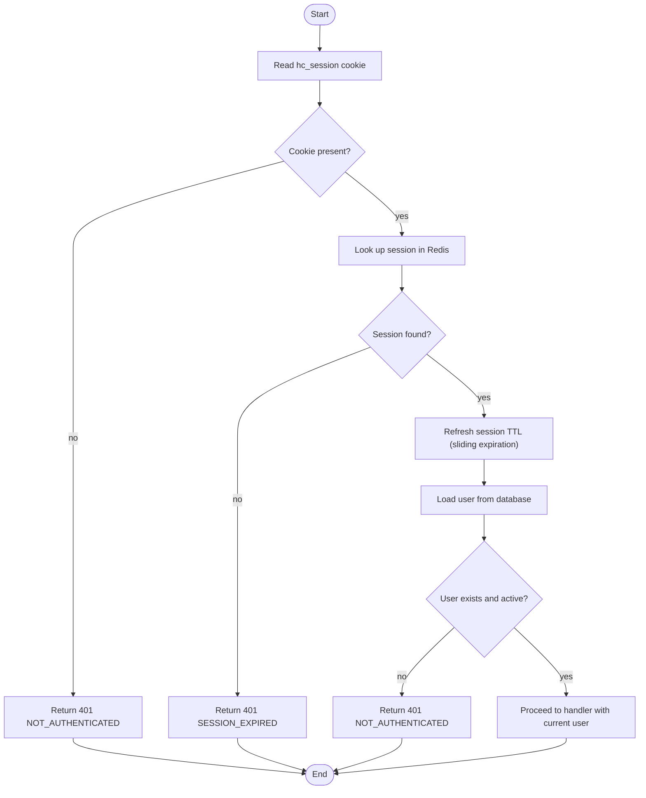

### 4.5 Authorization (role check)

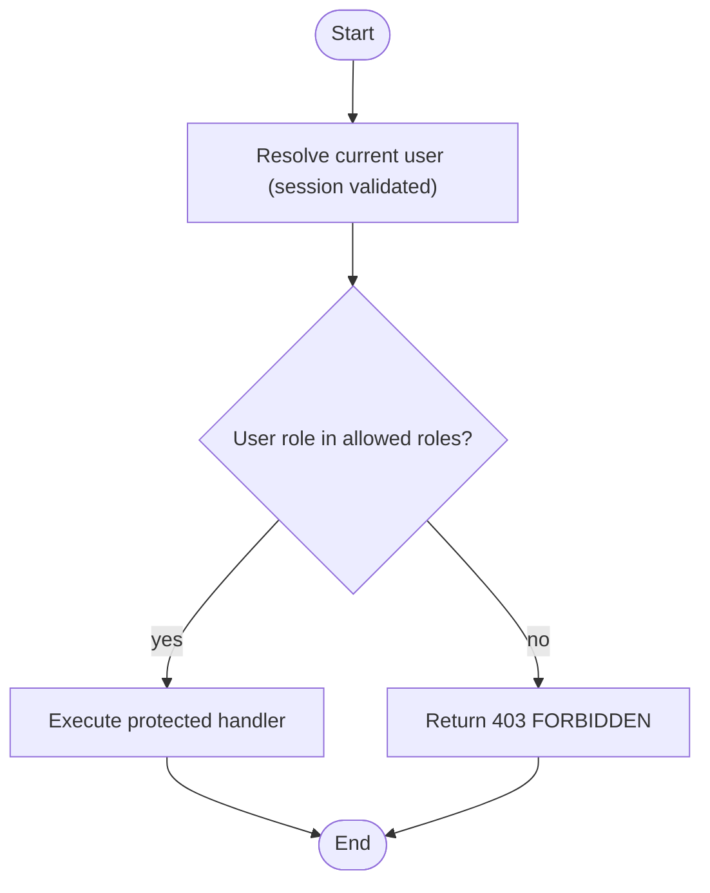

## 5. Interactions — sequence diagrams

### 5.1 Registration

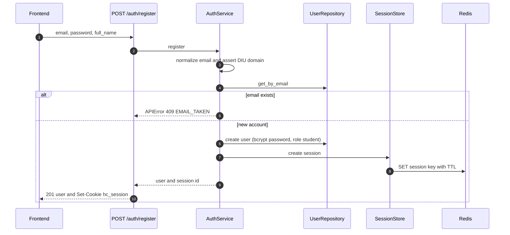

### 5.2 Email login

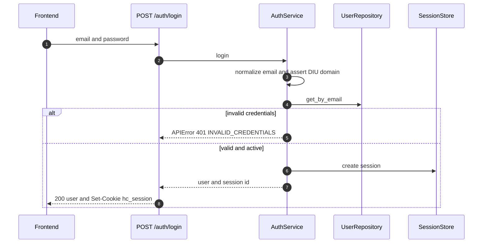

### 5.3 Google sign-in

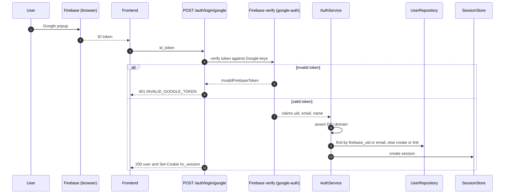

### 5.4 Authenticated request (/auth/me)

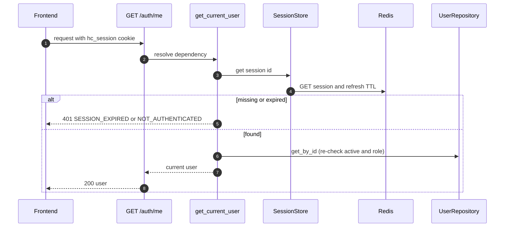

### 5.5 Logout

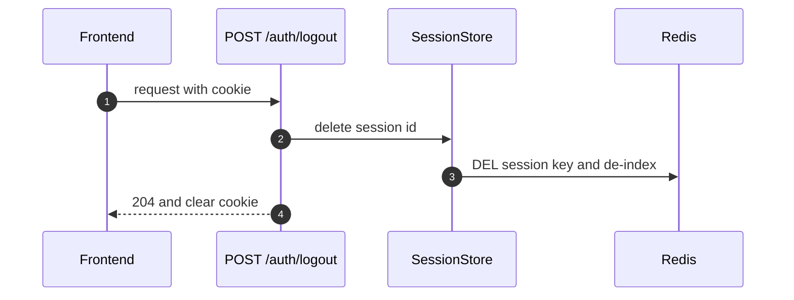

## 6. Redis session model

Opaque, server-side sessions (not a JWT in the cookie) → revocable, secrets stay
server-side. The session id is a 256-bit random token, sent only as an `HttpOnly`
cookie named `hc_session`.

| Key | Type | Value | TTL |
|-----|------|-------|-----|
| `session:<sid>` | string | JSON with `user_id`, `role`, `email` | 7 days, refreshed on every authenticated read (sliding) |
| `user_sessions:<user_id>` | set | all active session ids for the user | 7 days |

`SessionStore` operations: `create`, `get` (refreshes TTL), `delete`,
`delete_all_for_user` (revoke every session for one user).

## 7. Configuration

`app/core/config.py` (pydantic-settings, read from `.env`):

| Setting | Env var | Default | Notes |
|---------|---------|---------|-------|
| `database_url` | `DATABASE_URL` | — | async DSN (`postgresql+asyncpg://…:5440/…`) |
| `redis_url` | `REDIS_URL` | `redis://localhost:6379/0` | `…:6382/0` locally |
| `secret_key` | `SECRET_KEY` | — | required |
| `firebase_project_id` | `FIREBASE_PROJECT_ID` | `None` | required for Google sign-in |
| `session_ttl_seconds` | `SESSION_TTL_SECONDS` | `604800` | sliding |
| `session_cookie_secure` | `SESSION_COOKIE_SECURE` | `false` | **true in prod** |
| `session_cookie_samesite` | `SESSION_COOKIE_SAMESITE` | `lax` | **none for cross-site prod** |
| `allowed_email_domains` | `ALLOWED_EMAIL_DOMAINS` | `["diu.edu.bd"]` | JSON array |
| `backend_cors_origins` | `BACKEND_CORS_ORIGINS` | `["http://localhost:3000"]` | JSON array |

## 8. Error model

Domain errors raise `APIError(status, code, detail)`, rendered as
`{ "detail": "...", "code": "SNAKE_CASE_CODE" }`.

| Code | HTTP | When |
|------|------|------|
| `NOT_AUTHENTICATED` | 401 | no/invalid session cookie |
| `SESSION_EXPIRED` | 401 | session missing/expired in Redis |
| `INVALID_CREDENTIALS` | 401 | bad email/password |
| `INVALID_GOOGLE_TOKEN` | 401 | Firebase token fails verification |
| `EMAIL_TAKEN` | 409 | register with an existing email |
| `EMAIL_DOMAIN_NOT_ALLOWED` | 403 | non-DIU email |
| `ACCOUNT_DISABLED` | 403 | `is_active = false` |
| `FORBIDDEN` | 403 | role not permitted |

## 9. Security model

- **Sessions:** opaque 256-bit id, server-side in Redis, revocable, sliding TTL.
- **Cookie:** `HttpOnly`, `Secure` in production, `SameSite` lax/none.
- **Passwords:** bcrypt with per-password salt, 72-byte truncation; Google-only
  accounts store no password.
- **Identity:** Firebase ID tokens verified against Google's public keys with the
  project id as audience.
- **Policy:** DIU email allow-list and role-based guards; the user is re-loaded
  from the database each request so deactivation and role changes apply at once.
- **Transport:** CORS restricted to explicit origins with credentials; structured
  `{detail, code}` errors.

## 10. Deployment

- `Dockerfile` has `development` (fastapi dev) and `production` (uvicorn, 4
  workers, non-root) targets; `docker-compose.yml` wires Postgres + Redis + API
  with healthchecks.
- **Production:** set `SESSION_COOKIE_SECURE=true` and
  `SESSION_COOKIE_SAMESITE=none` (cross-site) — or serve frontend and API on the
  same site so the cookie stays first-party; add the frontend origin to
  `BACKEND_CORS_ORIGINS`; run `alembic upgrade head` on release.
- **Local:** `docker compose up -d postgres redis && make migrate`, then
  `uv run fastapi dev app/main.py`.
