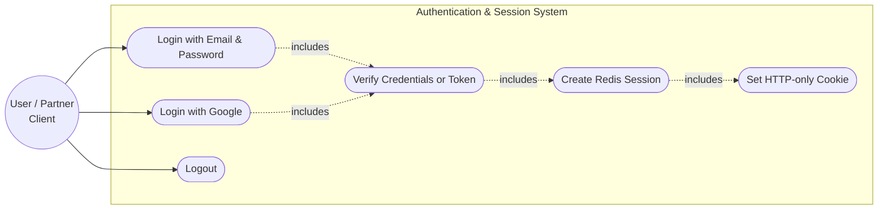
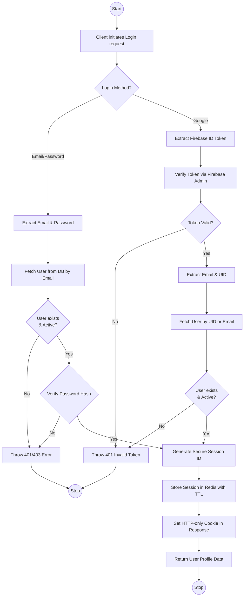
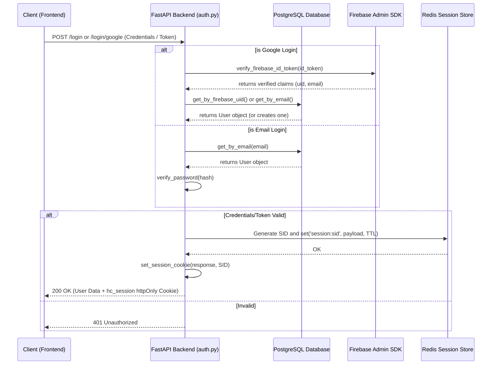

# Authentication & Login Integration Documentation

This document explains how the authentication system and session orchestration are implemented within the Hall Canteen project.

## Overview

The Hall Canteen backend handles authentication using a hybrid approach, supporting both traditional email/password credentials and Google Sign-In via Firebase. Instead of issuing JWTs, the application relies on secure, opaque server-side sessions stored in Redis.

**Key Features:**
- **Multiple Providers:** Supports standard email/password login as well as Google authentication via Firebase ID tokens.
- **Opaque Sessions (Redis):** After successful authentication, a high-entropy, 32-byte URL-safe session token is generated and stored in Redis with a TTL (Time-To-Live).
- **HTTP-Only Cookies:** The session token is delivered to the client exclusively via an `httpOnly` cookie (`hc_session`), mitigating XSS vulnerabilities.
- **Sliding Expiration:** Sessions in Redis automatically refresh their expiration time on each authenticated request.
- **Domain Restrictions:** Standard registration enforces specific email domains (e.g., `@diu.edu.bd`) to restrict access.

## Supported Use Cases

Currently, the authentication service supports the following workflows:
1. **Login with Email & Password:** Verifies user credentials against hashed passwords stored in PostgreSQL.
2. **Login with Google:** Verifies a Firebase ID token generated by the client. Links to an existing account if the email matches, or creates a new account.
3. **Session Revocation (Logout):** Deletes the user's session from Redis and clears the client's cookie.

---

## 1. Use Case Diagram

The use case diagram illustrates how clients interact with the Authentication & Session System.

---

## 2. Activity Diagram

The activity diagram shows the step-by-step logical flow of the login process, covering both the email and Google authentication paths.

---

## 3. Sequence Diagram

The sequence diagram demonstrates the communication between the Client, FastAPI Backend, PostgreSQL Database, Redis Store, and Firebase SDK during authentication.

## Environment Configuration

The authentication and session mechanics rely on the following environment variables defined in `config.py`:

- `SECRET_KEY`: Used for hashing and cryptographic operations.
- `FIREBASE_PROJECT_ID`: Used to verify Firebase ID tokens sent from the client.
- `REDIS_URL`: Connection string for the Redis session store (e.g., `redis://localhost:6379/0`).
- `SESSION_COOKIE_NAME`: The name of the session cookie (default is `hc_session`).
- `SESSION_TTL_SECONDS`: Expiration time for sessions in Redis (default is 7 days).
- `SESSION_COOKIE_SECURE`: Ensures the cookie is only sent over HTTPS (set to `True` in production).
- `ALLOWED_EMAIL_DOMAINS`: Restricts standard registration to specific domains (e.g., `diu.edu.bd`).
