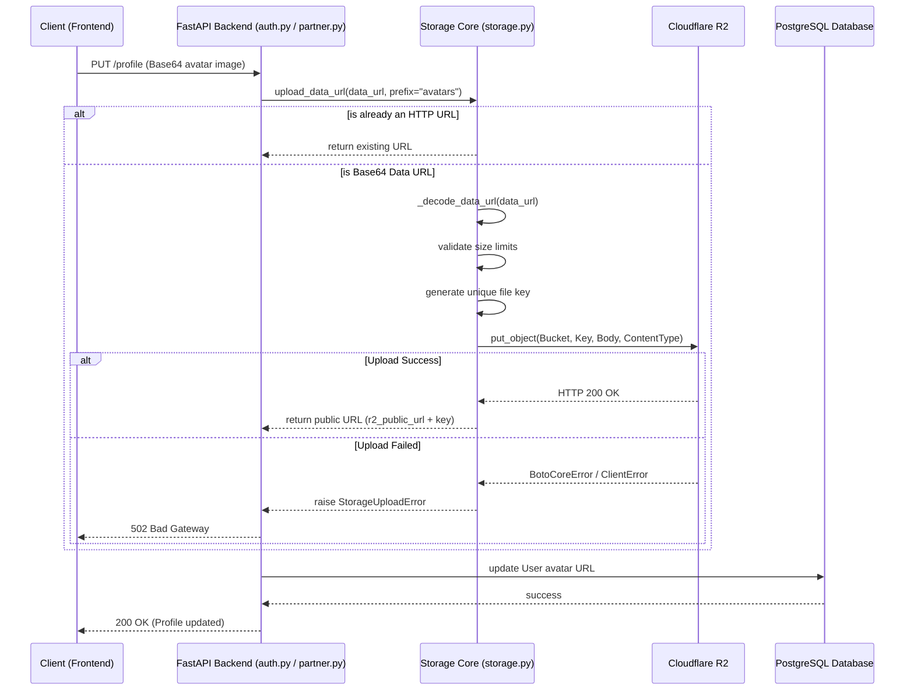

# Cloudflare R2 Storage Integration Documentation

This document explains how the Cloudflare R2 bucket (S3-compatible object storage) is integrated and utilized within the Hall Canteen project.

## Overview

The Hall Canteen backend uses Cloudflare R2 to store image uploads. Instead of saving large binary blobs or Base64-encoded images directly into the PostgreSQL database, the application uploads these files to the R2 bucket and stores only the resulting public URL in the database.

**Key Features:**
- **S3 Compatibility:** Interactions with the R2 bucket are handled using the `boto3` AWS SDK.
- **Base64 Processing:** The client sends images as Base64-encoded Data URLs. The backend decodes them, extracts the MIME type, and determines the correct file extension.
- **File Size Validation:** A configurable size limit (`upload_max_file_size_mb`) is enforced before uploading.
- **Unique Naming:** Files are renamed using UUIDs (`uuid.uuid4().hex`) to prevent naming collisions.
- **Async Execution:** The blocking `boto3` operations are executed asynchronously using FastAPI's `run_in_threadpool`.

## Supported Use Cases

Currently, the R2 storage is used in the following workflows:
1. **User Profile Updates:** Users can upload profile avatars. Images are saved with the `avatars/` prefix.
2. **Partner Onboarding:** Prospective partners must provide a photo of their shop when applying. These photos are saved with the `partner-applications/` prefix.

---

## 1. Use Case Diagram

The use case diagram illustrates the actors interacting with the system to trigger file uploads to the R2 bucket.

```mermaid
usecase
    actor "User / Partner (Client)" as Client
    actor "Cloudflare R2 Bucket" as R2

    rectangle "Hall Canteen Backend" {
        usecase "Upload Avatar Image" as UC1
        usecase "Submit Partner Application Photo" as UC2
        usecase "Process Base64 Image Data" as UC3
        usecase "Store Object & Generate URL" as UC4
    }

    Client --> UC1
    Client --> UC2
    
    UC1 ..> UC3 : <<includes>>
    UC2 ..> UC3 : <<includes>>
    UC3 ..> UC4 : <<includes>>
    
    UC4 --> R2
```

---

## 2. Activity Diagram

The activity diagram shows the step-by-step logical flow of the `upload_data_url` function, which is the core utility for handling R2 uploads.

```mermaid
activity
    start
    :Client submits Base64 Data URL;
    
    if (Is URL already a valid HTTP/HTTPS link?) then (Yes)
        :Return URL as-is (Idempotent);
        stop
    else (No)
        :Regex match Data URL;
        if (Valid Data URL format?) then (Yes)
            :Extract MIME type & Extension;
            :Decode Base64 to Bytes;
            if (Decode successful & not empty?) then (Yes)
                :Check Byte Size;
                if (Size <= Max Allowed Size?) then (Yes)
                    :Generate unique Key (Prefix + UUID + Ext);
                    :boto3 client put_object to R2;
                    if (Upload successful?) then (Yes)
                        :Construct Public URL;
                        :Return Public URL;
                        stop
                    else (No)
                        :Throw StorageUploadError (502);
                        stop
                    endif
                else (No)
                    :Throw StorageError (400 - File Too Large);
                    stop
                endif
            else (No)
                :Throw StorageError (400 - Invalid Base64/Empty);
                stop
            endif
        else (No)
            :Throw StorageError (400 - Invalid Format);
            stop
        endif
    endif
```

---

## 3. Sequence Diagram

The sequence diagram demonstrates the communication between the Client, the FastAPI Backend Service, and the Cloudflare R2 bucket during an image upload process (e.g., uploading an avatar).



## Environment Configuration

The R2 storage relies on the following environment variables defined in `config.py`:

- `R2_ENDPOINT`: The S3 API endpoint provided by Cloudflare.
- `R2_ACCESS_KEY_ID`: Cloudflare R2 Access Key.
- `R2_SECRET_ACCESS_KEY`: Cloudflare R2 Secret Key.
- `R2_BUCKET`: The name of the bucket (e.g., `hall-canteen-assets`).
- `R2_PUBLIC_URL`: The custom domain or `r2.dev` public URL mapped to the bucket.
- `UPLOAD_MAX_FILE_SIZE_MB`: The maximum allowed file size in megabytes (default is 10 MB).
