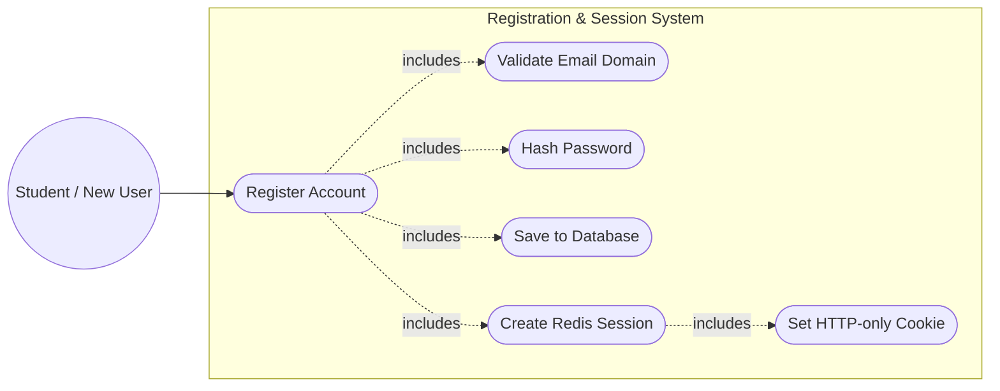
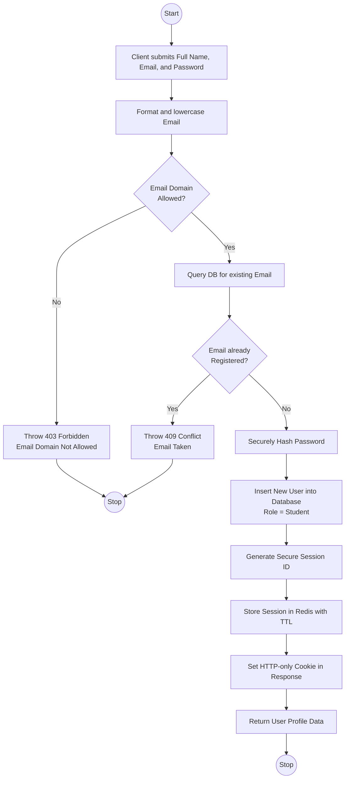
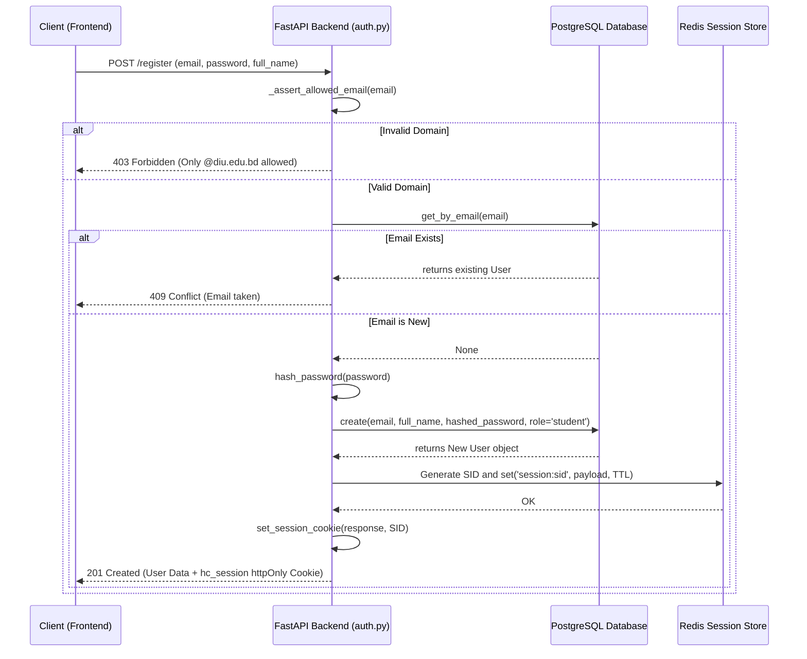

# Registration Integration Documentation

This document explains how the user registration system is implemented within the Hall Canteen project.

## Overview

The Hall Canteen backend handles standard student registration through a dedicated endpoint. The system is designed to restrict self-serve registrations to students of a specific institution (e.g., Daffodil International University) by validating email domains. Upon successful registration, the user is automatically logged in via a secure, server-side Redis session.

**Key Features:**
- **Domain Restriction:** Enforces that the user signs up with an allowed email domain (e.g., `@diu.edu.bd`), configurable via environment variables.
- **Password Security:** Passwords are never stored in plain text. They are hashed securely before being saved to the PostgreSQL database.
- **Implicit Login:** Successfully registering immediately creates a session for the user, negating the need for them to log in separately after signing up.
- **Opaque Sessions (Redis):** Similar to the login mechanism, a high-entropy session token is generated and stored in Redis with a TTL.
- **HTTP-Only Cookies:** The session token is delivered to the client exclusively via an `httpOnly` cookie (`hc_session`).

*(Note: Partner onboarding uses a separate application flow and does not enforce the student domain restriction. See partner documentation for details.)*

## Supported Use Cases

Currently, the registration service supports the following workflow:
1. **Student Registration:** A new user registers using their full name, student email, and a password.

---

## 1. Use Case Diagram

The use case diagram illustrates how clients interact with the Registration System.

---

## 2. Activity Diagram

The activity diagram shows the step-by-step logical flow of the registration process.

---

## 3. Sequence Diagram

The sequence diagram demonstrates the communication between the Client, FastAPI Backend, PostgreSQL Database, and Redis Store during the registration flow.

## Environment Configuration

The registration process utilizes the following environment variables defined in `config.py`:

- `ALLOWED_EMAIL_DOMAINS`: A list of permitted domains (e.g., `['diu.edu.bd']`). If empty, the restriction is disabled.
- `SECRET_KEY`: Used for hashing the passwords securely.
- `REDIS_URL`: Connection string for the Redis session store.
- `SESSION_COOKIE_NAME`: The name of the session cookie (`hc_session`).
- `SESSION_TTL_SECONDS`: Expiration time for sessions in Redis.
- `SESSION_COOKIE_SECURE`: Ensures the cookie is only sent over HTTPS (set to `True` in production).
